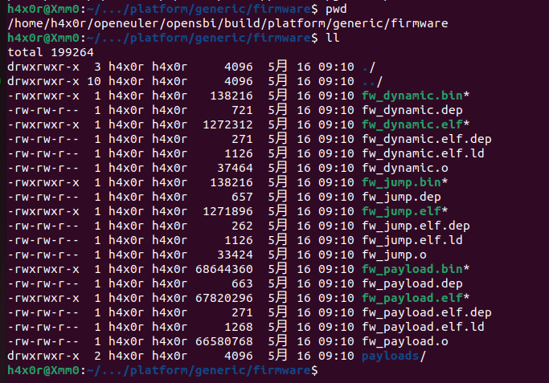

# syzkaller

[TOC]

## 目标

使用syzkaller对openeuler 23.03进行测试

## 环境

操作系统	 ：  Ubuntu 22.04 

内核版本 	：  6.2.2-060202-generic

QEMU版本 ：  7.2.0

GCC版本 	： 11.3.0

git版本    	：  2.34.1

## 步骤

### 编译内核

#### 下载openeuler 23.03源码

```bash
git clone --depth=1 --branch v6.1.19 https://gitee.com/openeuler/kernel.git
```

#### 配置kernel编译选项

由于syzkaller需要KCOV支持，所以需要在menuconfig中开启

主要根据syzkaller的[推荐选项](https://github.com/google/syzkaller/blob/master/docs/linux/kernel_configs.md)来配置，开启了KALLSYM，KASAN，KMSAN，DEBUGFS等选项


#### 下载riscv-toolchain

```bash
git clone --depth=1 https://github.com/riscv/riscv-gnu-toolchain
```

安装依赖

```bash
sudo apt-get install autoconf automake autotools-dev curl python3 libmpc-dev libmpfr-dev libgmp-dev gawk build-essential bison flex texinfo gperf libtool patchutils bc zlib1g-dev libexpat-dev ninja-build
```

make

```bash
sudo mkdir -p /opt/riscv64-linux/
./configure --prefix=/opt/riscv64-linux
sudo make -j `nproc`
```

设置环境变量

```bash
echo 'export PATH=$PATH:/opt/riscv64-linux/bin/' >> ~/.bashrc 
```


#### 编译内核

```bash
make ARCH=riscv CROSS_COMPILE=riscv64-unknown-linux-gnu- -j 32
```


### 下载并编译OpenSBI

```bash
git clone --depth=1 https://github.com/riscv-software-src/opensbi.git
```

按照[此文档](https://github.com/riscv-software-src/opensbi/blob/master/docs/platform/qemu_virt.md)的说明，将linux内核作为payload进行编译


同时参考[syzkaller的文档](https://github.com/google/syzkaller/blob/master/docs/linux/setup_linux-host_qemu-vm_riscv64-kernel.md)添加了CROSS_COMPILE环境变量


编译命令

```bash
    make CROSS_COMPILE=riscv64-unknown-linux-gnu- PLATFORM_RISCV_XLEN=64 PLATFORM=generic FW_PAYLOAD_PATH=/home/h4x0r/openeuler/openeuler-kernel-v6.1.19/kernel/arch/riscv/boot/Image -j 32
```



### 创建rootfs

#### 下载buildroot

从官网上找到最新的LTS版本压缩包


下载解压

#### 编译

```bash
make qemu_riscv64_virt_defconfig
make menuconfig
```

由于syzkaller需要被测试的vm通过ssh进行文件传输，所以需要根据文档对buildroot的选项进行一些修改


完成后make进行打包


### 启动运行

根据opensbi文档的运行步骤来修改openeuler官网给出的start_vm.sh


```bash
#!/usr/bin/env bash

RESTORE=$(echo -en '\001\033[0m\002')
YELLOW=$(echo -en '\001\033[00;33m\002')

## Configuration
vcpu=8
memory=8
memory_append=`expr $memory \* 1024`
drive="$(ls *.ext2)"
fw="fw_jump.bin"
ssh_port=12055

cmd="/usr/local/bin/qemu-riscv64/bin/qemu-system-riscv64 \
  -nographic -machine virt \
  -smp "$vcpu" -m "$memory"G \
  -bios "$fw" \
  -kernel ./Image \
  -drive file="$drive",format=raw,id=hd0 \
  -object rng-random,filename=/dev/urandom,id=rng0 \
  -device virtio-rng-device,rng=rng0 \
  -device virtio-blk-device,drive=hd0 \
  -device virtio-net-device,netdev=usernet \
  -append 'root=/dev/vda rw console=ttyS0' \
  -netdev user,id=usernet,hostfwd=tcp::"$ssh_port"-:22 \
  -device qemu-xhci -usb -device usb-kbd -device usb-tablet"

echo ${YELLOW}:: Starting VM...${RESTORE}
echo ${YELLOW}:: Using following configuration${RESTORE}
echo ""
echo ${YELLOW}vCPU Cores: "$vcpu"${RESTORE}
echo ${YELLOW}Memory: "$memory"G${RESTORE}
echo ${YELLOW}Disk: "$drive"${RESTORE}
echo ${YELLOW}SSH Port: "$ssh_port"${RESTORE}
echo ""

sleep 1

eval $cmd
```

将opensbi中编译得到的fw_jump.bin和buildroot得到的rootfs.ext2以及编译出来的内核镜像复制过来

运行脚本


### 出现问题

opensbi启动成功，但是没有其他反应，同时观察到某一核的cpu占用很高，在运行五分钟后也依然没有其他输出


### 尝试解决

向群友提问后得到一种解决方案，可以先将内核编译为rpm包安装，提取出boot下的vmlinuz用于qemu启动

将内核编译为rpm包


此处遇到一个问题，oerv 23.03的内核版本为6.1.19-2，恰好高于编译出的版本一些，导致rpm无法升级

于是将oerv23.03更换为oerv 22.03来解决

但是在提取出vmlinuz后opensbi依然在启动过程中挂起

