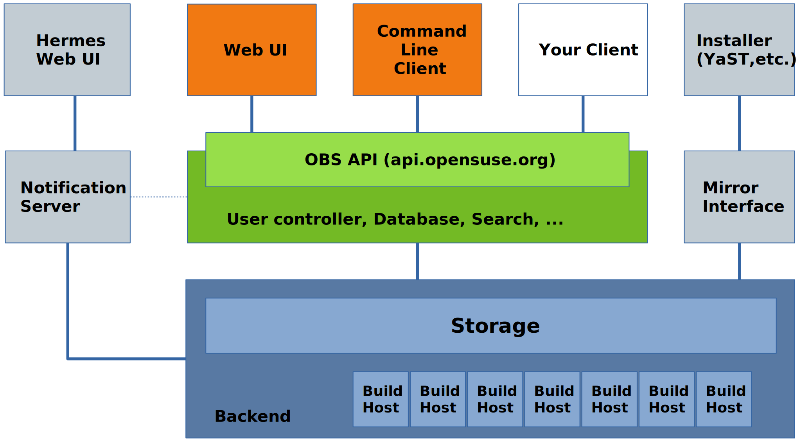

主要是对[obs文档](https://openbuildservice.org/help/manuals/obs-user-guide/)的阅读笔记（消化性笔记与简单翻译）

## 概念

OBS是一个用于从源码构建并分发软件包的通用系统，并以一种可再现，自动化，具有一致性的方式实现了这样的需求。

OBS可以为一众操作系统和linux发行版创建软件包与镜像，同时也支持多种架构

## build recipe

构建配方，是用于指导obs构建软件包的一类文件

其中需要有

- metadata 包含不可省略的包名与描述，以及可选的版本信息，软件许可信息，上游url
- requirements  包含软件构建时与安装时的依赖信息
- package list   指明哪些文件属于软件包，用于包管理器正确的安装与清理包

在基于RPM格式的软件包的linux发行版，这类文件一般具有.spec后缀

## architecture overview

obs服务器需要提供一个web接口与api，开发人员通过osc工具来调用api

服务器内部维护多个各个发行版的build host，相互隔离

构建时，依照recipe下载依赖包并安装，并运行recipe中的所有指令，构建成功时，软件会被安装到对应的host，并进行下一步打包成相应的包格式，最后放入到下载仓库中。

## 项目和包

在obs中以项目的形式来管理包，一个项目中可以包含多个包，且一般为某些组织活动所用

同时一些概念，如一般的访问权限控制，相关仓库，构建目标（目的操作系统和架构），都是在项目的层面来操作的。

项目也能够包含有子项目，但是却可以与母项目分离开来，独立进行配置

每个项目名需要以冒号进行分隔，如M17N:fonts，fonts为M17N的子项目

对于用户来说，一般会在我们的home项目下构建软件包，在obs中一般用home:USERNAME来指代

用户可以在home项目下指定构建目标，上传下载以及构建软件包，也能够在临时子项目中创建子项目来在其他人的项目中工作