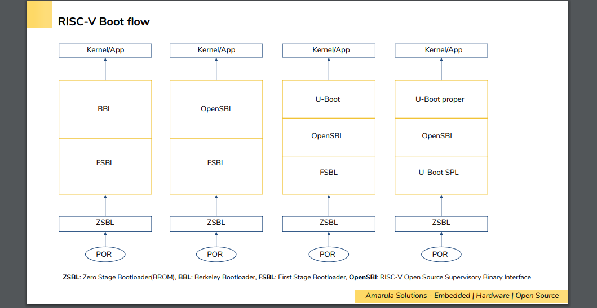
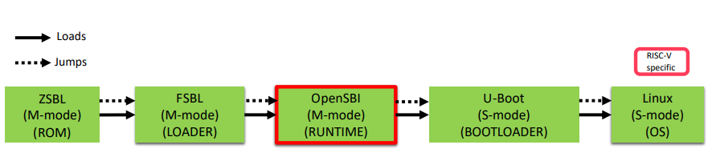

# riscv boot flow

riscv的权限模型

riscv的boot过程主要有如下几类

sbi的含义

在有opensbi下一般的boot流程图

使用dynamic firmware时的情形

参考资料

[1]: https://tinylab.org/riscv-opensbi-quickstart/	"RISCV opensbi快速上手"
[2]: https://crvf2019.github.io/pdf/43.pdf	"RISC-V boot flow overview"
[3]: https://www.slideshare.net/atishpatra/an-introduction-to-riscv-bootflow	"A Introduction to RISC-V Boot Flow"
[4]: https://github.com/riscv-software-src/opensbi/tree/master	"Opensbi github project and documentation"

